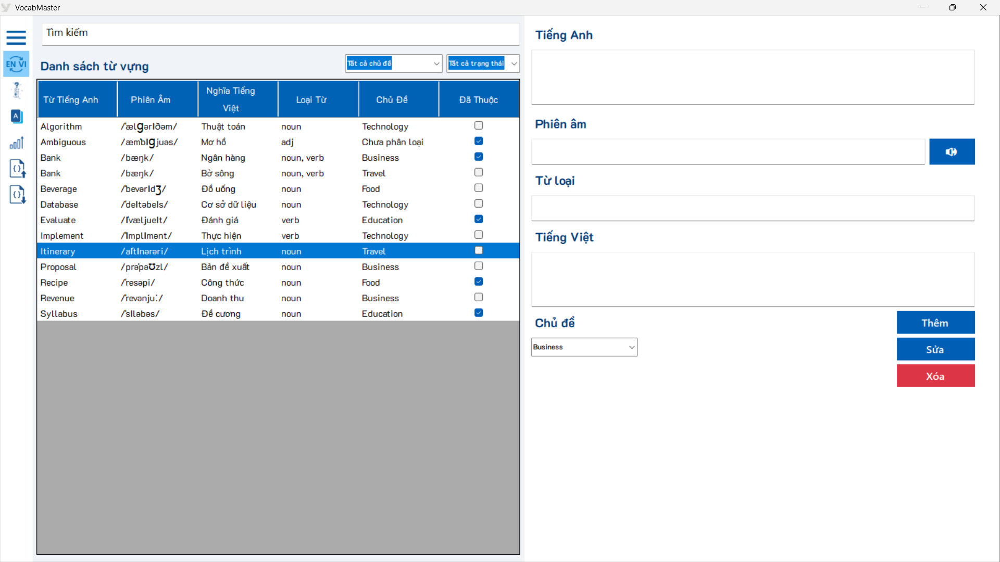
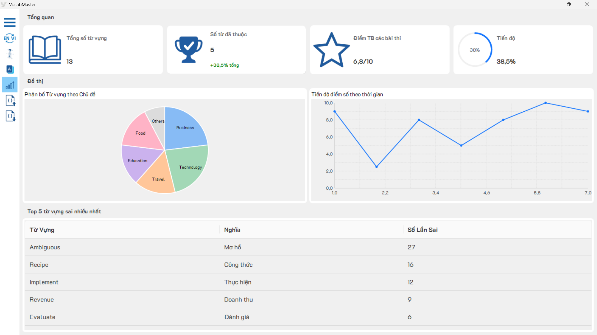
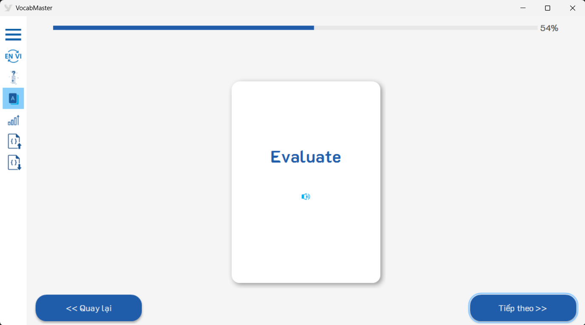
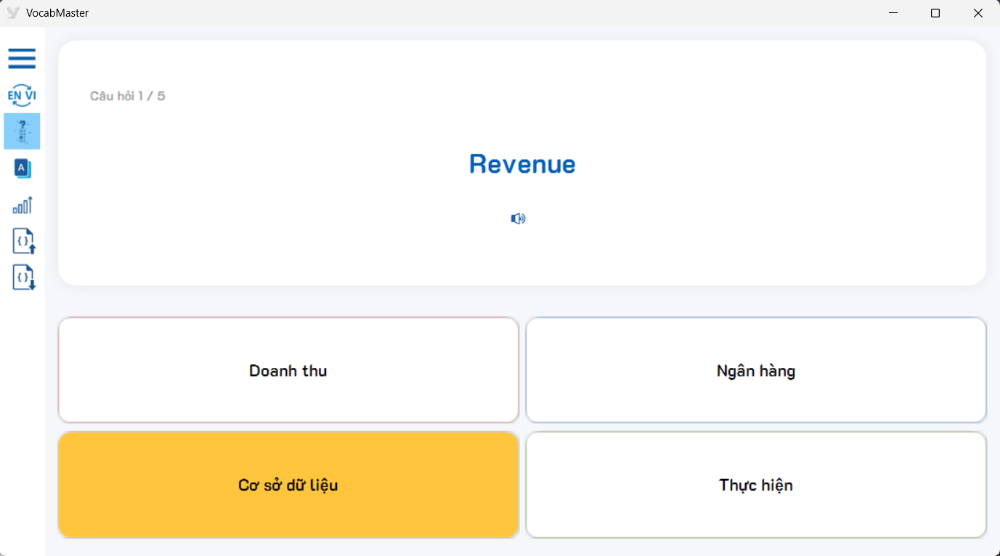

# 📚 VocabMaster - Ứng dụng Học Từ Vựng Tiếng Anh


**VocabMaster** là ứng dụng desktop xây dựng bằng ngôn ngữ C# trên nền tảng .NET WinForms. Ứng dụng giúp số hóa danh sách từ vựng, tích hợp công cụ dịch thuật tự động và tự tạo bài kiểm tra, giúp người học quản lý tiến độ và theo dõi các từ vựng thường làm sai một cách hệ thống.

---

## Tính năng chính

* **Tra cứu & Dịch thuật tự động:** Nhập từ vựng để hệ thống tự động dịch nghĩa (qua GTranslate), lấy phiên âm quốc tế và loại từ (qua Free Dictionary API). Hỗ trợ phát âm giọng Anh chuẩn.
* **Quản lý Kho từ:** Thêm, sửa, xóa, phân loại từ theo chủ đề và đánh dấu trạng thái "Đã thuộc".
* **Học qua Flashcard:** Trực quan hóa từ vựng bằng thẻ ghi nhớ hai mặt (Flashcard). Hỗ trợ lật thẻ và phát âm trực tiếp.
* **Luyện tập Trắc nghiệm:** Thuật toán tự động trộn câu hỏi từ kho từ vựng. Chấm điểm ngay lập tức và tự động đưa các từ chọn sai vào danh sách "Từ khó".
* **Thống kê (Dashboard):** Hiển thị biểu đồ phân bố chủ đề (Pie chart) và biểu đồ điểm số theo thời gian (Line chart).
* **Nhập/Xuất Dữ liệu:** Chia sẻ hoặc sao lưu kho từ vựng dễ dàng thông qua tệp `.json`.

---

## Ảnh chụp màn hình

### Màn hình Tra cứu và Quản lý


### Thống kê Dashboard


### Học qua Flashcard


### Trắc nghiệm Ôn tập


---

## Kiến trúc phần mềm & Công nghệ sử dụng

Dự án áp dụng mô hình phân lớp kết hợp (Forms - Services/Helpers - Models) để tối ưu mã nguồn.

* **Ngôn ngữ:** C# (WinForms)
* **Hệ quản trị CSDL:** Microsoft SQL Server (tương tác qua ADO.NET)
* **Thư viện bên thứ ba (NuGet):**
    * `AntdUI`: Thiết kế giao diện hiện đại và vẽ biểu đồ.
    * `Newtonsoft.Json`: Phân tích dữ liệu JSON từ API và xử lý file nhập/xuất.
    * `GTranslate`: Dịch thuật tự động văn bản.

---

## Hướng dẫn Cài đặt

1. **Clone repository này về máy:**
   ```bash
   git clone https://github.com/KimgionDev/VocabMaster-Winform.git
2. **Thiết lập Cơ sở dữ liệu:**
   * Mở SQL Server Management Studio.
   * Tạo một Database mới (ví dụ: `VocabMasterDB`).
   * Chạy các lệnh SQL (hoặc file `.sql` đính kèm nếu có) để tạo 4 bảng: `ChuDe`, `TuVung`, `TuVungKho`, `LichSuHocTap`.
   * Cập nhật chuỗi kết nối (`ConnectionString`) trong lớp `DatabaseHelper.cs` trỏ về máy chủ SQL của bạn.

3. **Chạy dự án:**
   * Mở tệp `VocabMaster.sln` bằng Visual Studio 2022.
   * Chờ Visual Studio tự động khôi phục các gói NuGet (hoặc nhấp chuột phải vào Solution -> Restore NuGet Packages).
   * Nhấn `F5` hoặc nút **Start** để chạy ứng dụng.

---

## Tác giả

* **Nguyễn Ngọc Đức Phát** (MSSV: B2303840)
* Đồ án học phần Lập trình .NET (CT246) - Đại học Cần Thơ (CTU).
